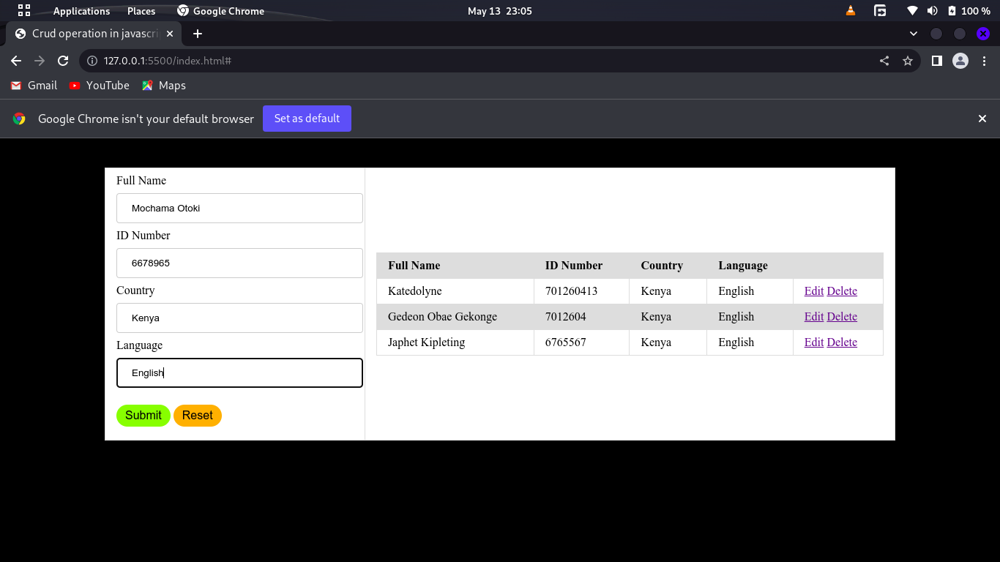

# Javascript CRUD Operations

create a user registration management system to capture users name, idnumber, country(use a select element to give various countries as options), languages spoken. On this app implement CRUD(create, read, update, delete)<!-- USING JAVASCRIPT DOM--> 

 

